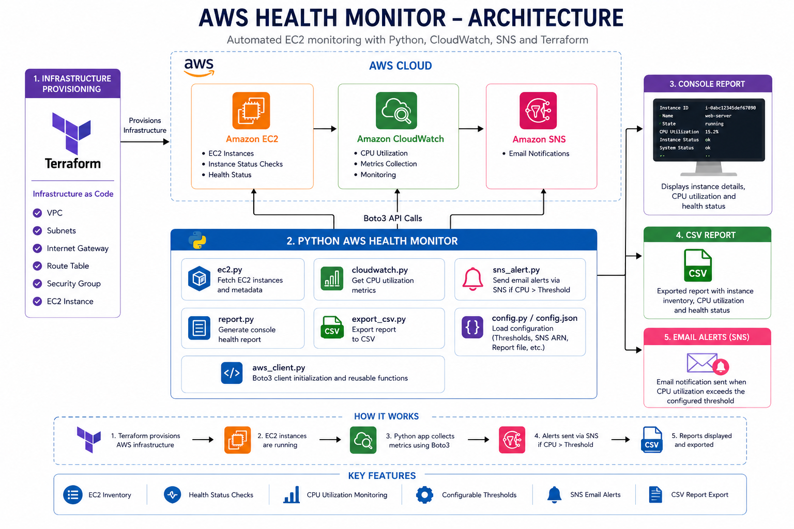

# AWS Health Monitor

A Python-based AWS monitoring tool that retrieves EC2 instance details, monitors CPU utilization using Amazon CloudWatch, exports reports to CSV, and sends email alerts using Amazon SNS.

## Architecture



## Features

- Provision infrastructure using Terraform
- Retrieve EC2 instance inventory
- Monitor CPU utilization with CloudWatch
- Check EC2 health status
- Export reports to CSV
- Send SNS email alerts
- Configure application using `config.json`

## Tech Stack

- Python
- AWS EC2
- Amazon CloudWatch
- Amazon SNS
- Terraform
- Boto3

## Project Structure

```text
AWS-HEALTH-MONITOR/
│
├── images/
│   └── architecture.png
│
├── python/
│   ├── aws_client.py         # Creates AWS service clients
│   ├── cloudwatch.py         # Retrieves CloudWatch CPU metrics
│   ├── config.json           # Application configuration
│   ├── config.py             # Loads configuration settings
│   ├── ec2.py                # Retrieves EC2 instance information
│   ├── export_csv.py         # Exports report to CSV
│   ├── main.py               # Application entry point
│   ├── report.py             # Prints EC2 health report
│   ├── requirements.txt      # Python dependencies
│   └── sns_alert.py          # Sends SNS email alerts
│
├── terraform/
│   ├── main.tf               # EC2 infrastructure
│   ├── outputs.tf            # Terraform outputs
│   ├── provider.tf           # AWS provider configuration
│   └── variables.tf          # Input variables
│
├── .gitignore
└── README.md
```

## Configuration

Update `python/config.json`:

```json
{
  "cpu_threshold": 80,
  "report_file": "ec2_report.csv",
  "sns_topic_arn": ""
}
```

## Run the Project

```bash
cd python
pip install -r requirements.txt
python main.py
```

## Sample Output

```text
============================================================
AWS EC2 Health Monitor Report
============================================================

Instance Name: health-monitor-server
State: running
CPU Utilization: 0.05%
Instance Status: ok
System Status: ok

Total Instances: 1
Running Instances: 1
Stopped Instances: 0
============================================================
```

## Author

**Jeevitha MC** 